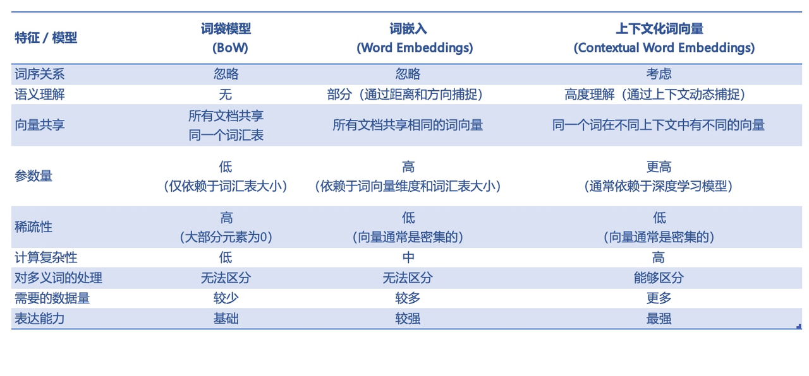

# 词向量生成过程

## 一、引言
词向量，简单的说就是**将文字转化为计算机可理解的语言**。这个过程把语言这种**符号信息**转化为**向量形式的数字信息**，即将自然语言问题转换为机器学习的问题。主流的词向量主要有**独热编码 (One-hot encoding) 模型和分布式表征 (distributed representation) 模型。**

主流的词向量主要有**独热编码 (One-hot encoding)** 模型和**分布式表征 (distributed representation) 模型**。

**独热编码**：其核心思想是每个单词用很长的向量表示，向量的维度是词汇表的长度，向量只有一个位置为1，其余位置均为0。例如[“猫”，“狗”，“鱼”]对应的独热编码向量为[1,0,0]、[0,1,0]和[0,0,1]。显然独热编码不具备语义信息，只是单纯地表示单词存在，而且会造成维度爆炸等后果。

**分布式表征**：其核心思想是词语的语义是通过上下文信息来确定的，即相同语境出现的词，其语义也相近。也就是说该模型最大的贡献就是让相关或者相似的词，在距离上更接近了。

具体来说，不同于独热编码的稀疏表示，分布式表征是一种固定长度的稠密词向量。一般形式如 [0.618, −0.401, −0.401, 0.419, …]。

分布式表征词向量编码一定程度上解决了独热编码忽略词汇上下文的问题，而且词典的长度是固定的，也避免了词向量维度过大导致的计算问题。

 Word2Vec 模型是生成分布式表征词向量模型的方式之一 (其他生成方式还有 LSA 矩阵分解模型、PLSA 潜在语义分析概率模型、LDA 文档生成模型等)。看不懂，没关系。**总的来说就是分布式表征可以做到算得又快又好，而 Word2Vec 正好可以产生分布式表征的词向量**。

## 二、基于统计的词向量

### （一）词袋模型（Bag - of - Words，BoW）
1. **原理**
   - 词袋模型是一种简单的文本表示方法。它忽略文本中词语的顺序和语法结构，仅将文本看作是一个词的集合。例如，对于句子“我喜欢自然语言处理”和“自然语言处理很有趣，我很喜欢”，在词袋模型中它们的表示是相同的，都是包含“我”“喜欢”“自然语言处理”“很”“有趣”这些词的集合。
2. **构建过程**
   - 首先，需要构建一个词汇表。词汇表是语料库中所有不重复单词的集合。例如，对于一个包含多篇科技文章的语料库，词汇表可能包含“算法”“数据”“模型”等单词。
   - 然后，对于每个文本，统计词汇表中每个单词在该文本中出现的次数。假设词汇表有 $n$ 个单词，那么每个文本可以用一个长度为 $n$ 的向量来表示，向量中的每个元素对应词汇表中的一个单词，**元素的值为该单词在文本中的出现次数**。
3. **缺点**
   - 词袋模型没有考虑单词的顺序和语义信息。例如，“我喜欢他”和“他喜欢我”在词袋模型中的表示是一样的，但它们的语义完全不同。
   - 词汇表的大小会影响向量的维度。如果词汇表很大，那么向量的维度会很高，这会导致计算成本增加，并且可能会出现维度灾难的问题。

### （二）TF - IDF（词频 - 逆文档频率）
1. **原理**
   - TF - IDF是在词袋模型的基础上，考虑了单词在文本中的重要性。TF（词频）表示一个单词在一个**文本**中出现的频率，IDF（逆文档频率）表示一个单词在整个**语料库**中的稀有程度。通过将TF和IDF相乘，可以得到一个单词在特定文本中的重要性得分。
2. **构建过程**
   - 计算TF：对于文本 $d$ 中的单词 $w$，
     $TF_{w,d}=\frac{n_{w,d}}{\sum_{k}n_{k,d}}$，
     其中 $n_{w,d}$ 是单词 $w$ 在文本 $d$ 中的出现次数，
     $\sum_{k}n_{k,d}$
     是文本 $d$ 中所有单词的出现次数之和。

   - 计算IDF：
     $IDF_{w}=\log\frac{N}{df_{w}}$，
     其中 $N$ 是语料库中的文本总数，
     $df_{w}$ 是包含单词
     $w$ 的文本数量。

   - 最后，计算TF - IDF：
     $TF - IDF_{w,d}=TF_{w,d}\times IDF_{w}$。

3. **优点和缺点**
   - 优点是能够一定程度上体现单词在文本中的重要性，对文本分类等任务有一定的帮助。
   - 缺点是仍然没有考虑单词的语义信息，并且对于一些常见词（如“的”“是”等），TF - IDF值可能会过高，因为它们在很多文本中都会出现，这可能会掩盖其他更有意义单词的重要性。

## 三、基于神经网络的词向量

### （一）Word2Vec
1. **原理**
   - Word2Vec有两种主要的架构：CBOW（Continuous Bag - of - Words）和Skip - Gram。
   - CBOW是根据上下文来预测中心词。例如，对于句子“我爱自然语言处理”，如果以“自然语言处理”为中心词，那么“我”和“爱”就是上下文。模型的目标是根据“我”和“爱”来预测“自然语言处理”。
   - Skip - Gram则是相反，它是根据中心词来预测上下文。例如，根据“自然语言处理”来预测“我”和“爱”。
2. **训练过程**
   - 首先，需要将文本进行预处理，包括分词、构建词汇表等操作。假设词汇表大小为 $V$，词向量维度为 $d$。
   - 对于CBOW：
     - 输入是上下文单词的one - hot编码向量。如果词汇表大小为 $V$，那么一个单词的one - hot编码向量是一个长度为 $V$ 的向量，只有该单词对应的位置为1，其他位置为0。假设上下文窗口大小为 $m$，那么输入是 $2m$ 个one - hot编码向量（上下两侧各为 $m$ ）。
     - 这些one - hot编码向量会经过一个输入层到隐藏层的权重矩阵 $W_{V\times d}$，将它们转换为隐藏层的向量表示。隐藏层的维度为 $d$。
     - 隐藏层向量经过一个隐藏层到输出层的权重矩阵 $W'_{d\times V}$，得到输出向量。输出向量的维度为 $V$，表示每个单词在词汇表中出现的概率。
     - 通过反向传播算法，根据预测概率和真实中心词的标签，调整权重矩阵 $W$ 和 $W'$，使得预测概率更接近真实标签。
   - 对于Skip - Gram，训练过程类似，只是输入和输出的角色互换。
3. **优点**
   - 能够学习到单词的语义信息。例如，语义相似的单词在向量空间中会比较接近。“苹果”和“香蕉”的词向量距离会比“苹果”和“汽车”的词向量距离更近。
   - 可以通过简单的向量运算来体现单词之间的语义关系。例如，“男厨师”-“男人” + “女人” ≈ “女厨师”。

### （二）GloVe（Global Vectors for Word Representation）
1. **原理**
   - GloVe结合了基于统计的方法和神经网络的方法。它基于单词的共现矩阵来学习词向量。共现矩阵记录了单词在语料库中的**共现**次数（一个固定窗口内/一定范围内共同出现的次数）。例如，在一个语料库中，“苹果”和“水果”共现的次数可能会比较多，而“苹果”和“汽车”共现的次数会比较少。
2. **训练过程**
   - 首先，构建单词的共现矩阵。设语料库中有 $N$ 个单词，那么共现矩阵 $X$ 是一个 $N\times N$ 的矩阵，$X_{ij}$ 表示单词 $i$ 和单词 $j$ 在语料库中的共现次数。
   - 然后，定义一个目标函数，该目标函数基于共现矩阵中的元素与单词词向量之间的关系。具体来说，目标函数旨在最小化预测的共现概率与实际共现概率之间的差异。
   - 通过随机梯度下降等优化算法，更新词向量，使得目标函数达到最小值。
3. **优点**
   - 能够有效地利用语料库中的统计信息，学习到单词之间的语义和语法关系。
   - 训练速度相对较快，并且在一些大规模的语料库上能够取得很好的性能。
4. **缺点**
   - 依赖语料库，如果某个词在文本中出现次数太少（比如专业术语或冷门词），GloVe 很难准确学习它的含义，因为模型主要依赖“统计共现次数”，低频词的统计信息不足。
   - 无法处理“一词多义”的情况（每个单词只分配一个向量，太少），无法处理语料库之外的新词，无法处理动态上下文（因为固定窗口）。这些也是静态模型的通病。
   - 缺少词序的信息，例如“狗追猫”和“猫追狗”在共现统计中被视为相同。

## 四、词向量的完整生成过程
### （一） **数据收集与预处理阶段**
1. **收集语料库**
    - **首先要获取大量的文本数据作为语料库**。这些文本可以来自各种渠道，比如新闻文章、学术论文、小说、社交媒体帖子等。
     - 例如，若要构建一个用于新闻领域的词向量模型，就会收集大量的新闻稿件，像路透社、美联社等新闻机构发布的内容。
     - 语料库的规模和质量对词向量的性能有很大影响。**一般来说，更大、更多样化的语料库能够让词向量更好地捕捉语言的各种语义和语法特征**。
2. **文本清洗**：
     - **对收集到的文本进行清洗，去除噪声信息**。这包括删除HTML标签（如果是网页文本）、特殊字符（如过多的标点符号、表情符号等非文本核心内容）、多余的空格等。
     - 例如，将“&lt;p&gt;这是一段带有HTML标签的文本。&lt;/p&gt;”清理为“这是一段带有HTML标签的文本。”
3. **分词**：
     - **对于像中文、日文等语言，需要进行分词操作**。
     - 以中文为例，将句子“我爱自然语言处理”分为“我”“爱”“自然语言处理”等单词。
     - 对于英文等以空格分隔单词的语言，也可能需要进行一些特殊的处理，如将缩写词（如“don't”拆分为“do”和“not”）等情况。
4.  **构建词汇表**：
     - **统计语料库中出现的所有不重复单词，形成词汇表**。词汇表记录了模型能够处理的所有单词，并且可以为每个单词分配一个唯一的索引。
     - 例如，一个简单的词汇表可能包含“苹果”“香蕉”“汽车”等单词，并且每个单词都有对应的索引，如“苹果”的索引为0，“香蕉”的索引为1等。

### （二） **模型选择与架构设计阶段**
1. **基于统计的模型（早期方法）**：
     - **词袋模型（BoW）**：
       - 这种模型将文本看作是**单词的集合**，**忽略单词的顺序和语法结构**。它的架构相对简单，通过统计每个单词在文本中的出现次数来构建文本的向量表示。
       - 例如，对于一个包含“苹果”“苹果”“香蕉”的文本，其向量表示可能是[2,1]（假设词汇表中“苹果”索引为0，“香蕉”索引为1），表示“苹果”出现2次，“香蕉”出现1次。
     - **TF - IDF模型**：
       - 在词袋模型的基础上，考虑了单词的重要性。它通过计算词频（TF）和逆文档频率（IDF）的乘积来衡量一个单词在特定文本中的重要性。
       - 例如，在一个包含多篇科技和美食文章的语料库中，“算法”这个词在科技文章中可能有较高的TF - IDF值，因为它在科技文章中频繁出现，但在美食文章中很少出现，所以它在科技文章中的重要性就被凸显出来。
2. **基于神经网络的模型（主流方法）**：
     - **Word2Vec模型**：
       - 有CBOW（Continuous Bag - of - Words）和Skip - Gram两种主要架构。
       - CBOW是**根据上下文单词来预测中心词**，比如在句子“我喜欢自然语言处理”中，以“自然语言处理”为中心词，“我”和“喜欢”是上下文，模型通过上下文预测中心词。
       - Skip - Gram则相反，它**根据中心词预测上下文**。
       - 这两种架构都包含输入层、隐藏层和输出层。输入层接收单词的表示（如one - hot编码），经过隐藏层的转换，在输出层输出预测结果，通过反向传播算法不断调整模型的权重，以优化预测效果。
     - **GloVe模型**：
       - 基于单词的共现矩阵来学习词向量。它通过统计单词在语料库中的共现次数构建共现矩阵，然后利用这个矩阵来学习单词之间的语义关系。
       - 例如，如果“苹果”和“水果”在很多文本中同时出现，它们在共现矩阵中的值就会比较高，模型会根据这个信息学习到它们之间的语义关联，从而生成能够体现这种关系的词向量。

3. **模型训练阶段**
   - **定义目标函数**：
     - 对于基于统计的模型，目标函数可能是最小化文本表示与实际统计特征之间的差异。例如，在TF - IDF模型中，要使得计算得到的TF - IDF值能够准确反映单词在文本中的重要性。
     - 对于基于神经网络的模型，**目标函数通常是最小化预测结果与真实标签之间的误差**。
     - 在Word2Vec的**CBOW架构**中，目标是最小化预测的中心词概率分布与真实中心词之间的交叉熵损失；
     - 在**Skip - Gram架构**中，是最小化根据中心词预测上下文单词的概率分布与真实上下文单词之间的交叉熵损失；
     - 在**GloVe模型**中，目标函数是最小化预测的共现概率与实际共现概率之间的差异。
   - **选择优化算法**：
     - 常用的优化算法有随机梯度下降（SGD）及其变种，如Adagrad、Adadelta、Adam等。这些算法用于更新模型的参数，以逐步减小目标函数的值。
     - 例如，**Adam优化算法**会根据梯度的**一阶矩估计**和**二阶矩估计**来调整学习率，从而更有效地更新参数，加快模型收敛速度。
   - **训练过程监督与调整**：
     - 在训练过程中，需要监控模型的**性能指标**，如**损失值的下降情况**、词向量的质量评估指标（如单词之间的**相似度**准确性）等。
     - 如果损失值下降过慢或者出现不下降甚至上升的情况，可能需要调整优化算法的参数（如学习率），或者检查数据是否存在问题（如数据标注错误、数据格式不符合要求等）。

4. **词向量生成与评估阶段**
   - **生成词向量**：
     - 经过训练后，模型会为词汇表中的每个单词生成一个词向量。这些词向量可以是模型的中间层输出（如Word2Vec隐藏层的输出），也可以是通过模型的参数计算得到的（如GloVe模型通过学习共现矩阵得到的词向量）。
     - 例如，对于词汇表中的“苹果”这个单词，模型会生成一个固定维度（如100维、300维等）的向量来表示它。
   - **评估词向量质量**：
     - 可以使用一些评估指标来衡量词向量的质量。常用的有单词相似度评估，通过比较词向量之间的**余弦相似度**等指标来判断语义相似的单词在向量空间中的距离是否接近。
     - 例如，“汽车”和“卡车”这两个语义相似的单词，它们的词向量余弦相似度应该较高。
     - 还可以通过词向量在下游任务（如文本分类、命名实体识别等）中的性能来**间接评估**词向量的质量。如果使用某组词向量的下游任务取得了较好的效果，说明这组词向量能够较好地捕捉语言特征。

## 五、参考引用
1. Word2vec 官方文档：https://radimrehurek.com/gensim/models/word2vec.html

2. 多模态任务对齐：https://aistudio.baidu.com/blog/detail/16

3. 词向量如何来的？https://www.cnblogs.com/ghj1976/p/word-vector.html
