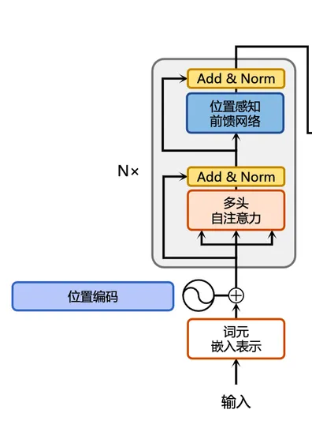

# 笔记3


Decoder主要介绍了Transformer中编码器的工作流程、结构（组成部分）。本章节详细介绍了多头自注意力机制。章节阐述如何计算缩放点积注意力，多头（Multi-Head）和自注意力运算（Self Attention）的具体含义，前馈全连接层的计算和作用等。本章节还详细对比了多头自注意力和多头注意力、自注意力运算和交叉注意力运算。内容详实，逻辑清晰。具体细节还有待后续查看，可能有些内容还需要补充。


## Transformer的结构


## 编码器（Encoder） 详解


### 单个编码器块的结构


论文中取了$N=6$，整整六个一样的编码器块


### 注意力机制的核心思想是：<p>
> **对于给定的 Query，计算其与所有 Key 的相似度，然后用这些相似度对 Value 进行加权求和，得到最终的输出。**

### Q、K、V名词解释<p>
Q、K 和 V 分别代表 Query（查询）、Key（键）和 Value（值）。这些术语的来源和它们在注意力机制中的角色都与数据库的查询概念有相似之处。在注意力机制中：<p>
-  **Query (Q):** 它代表了正在询问的信息或关心的上下文。在自注意力机制中，每个序列元素都有一个对应的查询，它试图从其他部分找到相关信息。<p>
-  **Key (K):** 这些是可以查询的条目或“索引”。在自注意力机制中，每个序列元素都有一个对应的键。<p>
-  **Value (V):** 对于每一个“键”，都有一个与之关联的“值”，它代表实际的信息内容。当查询匹配到一个特定的键时，其对应的值就会被选中并返回。<p>


### 缩放点积注意力(Scaled Dot-Product Attention)

每种注意力计算都有相应的计算公式，但本质上都是利用Query和Key之间的相似度，对Value进行加权求和。Transformer使用的是缩放点积注意力（Scaled Dot-Product Attention），其计算公式如下：
$$Attention(Q, K, V)=SoftMax(\frac{QK^T}{\sqrt{d_k}})V$$
这里的 $Q、K、V$ 都是对**输入词向量** $x$ 的线性映射。
- $Q = linear_q(x)$
- $K = linear_k(x)$
- $V = linear_v(x)$

缩放因子参数 $d_k$ （每个头的维度、也是 $Q$ 和 $K$ 的维度）通常是由总的模型维度 $d_{model}$ 和多头注意力的头数 $h$ 决定的，一般为 $d_{model} / h$ （除法取整数）。作用是在 $d_k$ 很大的时候，能够保证 $SoftMax$ 出来的权重不至于过分靠近两端（0和1）。

> 超参数 $ d_{model} $可以调整，而线性映射关系（一般是矩阵）是训练得到的。

>$d_{model}$ Transformer设定的是512，所有层的输入、输出的向量维度都固定为这个值，包括词嵌入阶段。也就是说，输入词向量 $x$ 和最终输出词向量的维度 $z$ 都是 $d_{model} = 512$。

$SoftMax$ 函数用于对加权系数的归一化，使其为非负且加起来和为1。

下图是缩放点积注意力运算的流程图


实际操作的时候，我们是利用矩阵乘法来做运算而不是向量，这样可以一次性处理多个词向量，提高计算效率。

注意到流程图中，我们会用到**Mask掩盖操作**。
这是在Decoder中训练用到。目的是让 $q_t$，只能识别到 $k_1$ 到 $k_{t-1}$ ，这些 $QK$ 配对才有被赋予权重的意义，后面的 $QK$ 配对权重均为0。因为Decoder在做预测的时候，我们并不能知道 $t$ 时刻之后的输出值。Mask操作保证了预测和训练的结果是一致的。具体操作是在 $SoftMax$ 前将 $t$ 时刻后面的 $\frac{QK^T}{\sqrt{d_k}}$赋予一个很大的负数（1e-10），这样 $SoftMax$ 出来的权重就会是0。 


### 多头注意力机制（Multi-Head Attention）

在上述注意力计算中，我们训练能学习到的参数很有限，用于 $Q、K、V$ 线性映射的函数或矩阵是可以学习。为了让模型更加多样、适配更多的任务，Transformer参考CNN中**多通道**的思路，提出了多头注意力机制。这样可以让模型能学习到更多的参数，模型也能更加灵活、多样和泛用。

具体来说，如下图所示，多头(Multi-Head) 的方式是将同样的$Q、K、V$经过**不同的、多个线性映射和缩放点积注意力运算（多个 head） 输出 z**，然后进行**拼接**（**Concat**），通过线性变换得到**最后的输出 z**。


    
Multi-Head Attention把 $Q、K、V$ 通过参数矩阵映射，然后再做Attention，把这个过程重复做 h 次，结果拼接起来。<p>
具体用公式表达：<p>
$MultiHead(Q,K,V)=Concat(head_1,\ldots,head_h)W^O$
$head_i = Attention(QW_i^Q,KW_i^K,VW_i^V)$<p>
其中
$W_i^Q\text{、}W_i^K\text{、}W_i^V\text{、}W^O$ 
的权重矩阵的维度分别为<p>
$ (d_{model}\times{d}_{k})\text{、}(d_{model}\times{d}_{k})\text{、}(d_{model}\times{d}_{v})\text{、}(h{d}_{v}\times{d}_{model}) $ 

这些权重矩阵都是可以**训练的**（不同头的矩阵**参数不共享**）。这样就能让模型更加的多样、灵活和泛用。

>Concat（Concatenate，拼接）将所有头的输出沿着**特征维度**拼接，形成一个大矩阵。


### 自注意力机制（Self Attention）


### Add & Nrom
#### 残差连接（Addition）

#### 层归一化（Layer Normalization）

## 问题解答

### 1. 什么是多头注意力中的Concat操作？
在 Transformer 模型中，Concat（Concatenate，拼接） 是一种将多个向量或矩阵沿着特定维度连接在一起的操作。它的核心目的是合并不同来源的信息，让模型能够综合利用这些信息进行后续计算。

pytorch中利用torch.cat函数 即可拼接所有头的输出
```python
# 假设有 8 个注意力头，每个头输出维度 64
head1_output = ...  # 形状 [batch_size, seq_len, 64]
head2_output = ...  # 形状 [batch_size, seq_len, 64]
...
head8_output = ...  # 形状 [batch_size, seq_len, 64]

# 拼接所有头的输出（沿最后一个维度）
concatenated = torch.cat([head1_output, head2_output, ..., head8_output], dim=-1)
# 形状变为 [batch_size, seq_len, 8×64=512]

# 线性投影降维回 512 维
final_output = linear_layer(concatenated)  # 形状 [batch_size, seq_len, 512]
```


对比相加和拼接操作
|操作|特点|应用场景|
|-----|-----|----|
|Add（相加）|直接融合信息，不改变维度，依赖残差设计|	残差连接、门控机制（如 LSTM）|
|Concat（拼接）|保留所有原始信息，增加维度，需后续处理（如线性投影）|多头注意力、多特征源合并|


### 2. jupyter报错解决
```bash
    TqdmWarning: IProgress not found. Please update jupyter and ipywidgets. See https://ipywidgets.readthedocs.io/en/stable/user_install.html
    from .autonotebook import tqdm as notebook_tqdm
```
cmd输入
```bash
    pip install ipywidgets
```
