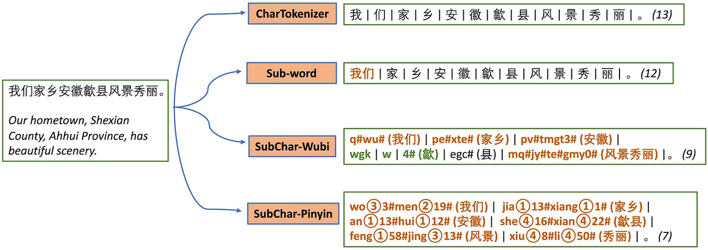
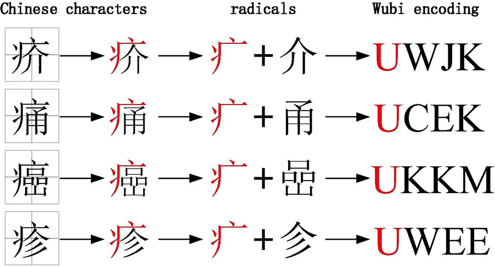

# 1.分词的原因
## 1. 将复杂问题转化为数学问题
通过将非结构化数据转化为结构化数据，从而可以被进行统计计算，这样做的原因是我们可以通过计算每个标识符（tokens）在文件中出现的频次从而形成一个频次向量（vector）组来表示文件。
因为计算机是无法直接处理我们人类所能辨识的文本信息，所以我们用统计的方式将纯文本信息转化为数字信息。完成了转换之后，就可以直接将这些频次向量作为特征输入到机器学习或者深度学习相关的算法模型中去进行训练。
## 2. 词的粒度比较合适
**（1）“词”是表达完整含义的最小单位。**

```
我喜欢喝咖啡。
词粒度Tokenized结果：
['我', '喜欢', '喝', '咖啡', '。']

I like coffee
词粒度Tokenized结果：
['I', 'like', 'coffee', '.']
```
**（2）“字”的粒度太小，无法表达完整含义。**
比如“牛”可以是“牛市”（股票市场上涨）或“牛人”（能力强的人）。只有将“牛”字放入特定的词汇或句子中，我们才能理解其完整含义。
```
Hello, world!
字符粒度Tokenized结果：
['H', 'e', 'l', 'l', 'o', ',', ' ', 'w', 'o', 'r', 'l', 'd', '!']
```
**（3）subword粒度Tokenization介于词粒度和字符粒度之间**
常见的subword Tokenization方法包括Byte Pair Encoding (BPE)、WordPiece等。这些方法通过统计文本数据中的子串频率，自动生成一种分词词典，能够有效应对未登录词（OOV）问题，同时保持一定的语义完整性。
```
helloworld
经过BPE算法训练后，生成的子词词典包含以下条目：
h, e, l, o, w, r, d, hel, low, wor, orld
子词粒度Tokenized结果：
['hel', 'low', 'orld']
```
**（4）“句子”的粒度太大，承载的信息量多，很难复用**
比如“牛人在吃牛排”，这个例子就很容易让人或机器产生疑惑。

> 深度学习时代，部分任务也可以**分“字”**
> 分词一直是 NLP 的基础，但是现在也不一定了，感兴趣的可以看看这篇论文：《Is Word Segmentation Necessary for Deep Learning of Chinese Representations?》。
> 不过在一些特定任务中，分词还是必要的。如：关键词提取、命名实体识别等。

# 2.中英文分词的3个典型区别
## 2.1区别1：分词方式不同，中文更难

**（1）中文分词：**
中文文本没有明显的单词分隔符，句子是由连续的汉字组成的字符串，单词的边界难以确定。
中文分词需要根据上下文来确定单词的边界，这通常涉及到复杂的算法和大量的语言知识。

 **（2）英文分词：**
英文单词之间通常由空格分隔，这使得分词过程相对简单。自然语言处理（NLP）工具可以很容易地通过空格来识别单词边界。
即使遇到连字符等特殊情况，英文分词也有较为明确的规则可以遵循。

## 2.2区别2：英文单词有多种形态，需要词性还原和词干提取
（**1）中文NLP的处理**
- 中文词汇通常不发生形态变化，因此不需要进行词性还原或词干提取。
- 中文词汇的意义通常不随上下文改变形态，例如“书”无论是单数还是复数，形式都是一样的。

**（2）英文单词的形态变化**
- **时态变化**：英文动词有多种时态形式，如“do”，“does”，“did”，“done”，“doing”等，它们都需要通过词性还原恢复到基本形式“do”。
- **名词复数**：英文名词的复数形式通常通过添加“-s”或“-es”来表示，如“city”变为“cities”，“child”变为“children”。
- **不规则变化**：有些英文单词的形态变化不规则，如“go”变为“went”，“be”变为“been”等。

**（3）英文NLP的独特处理步骤**
- **词性还原（Lemmatization）**：
  - 词性还原是将单词的变形形式还原到词典中的基本形式，这个基本形式称为“词元”（lemma）。
  - 例如，“does”，“done”，“doing”，“did”都会被还原为“do”。
- **词干提取（Stemming）**：
  - 词干提取是将单词缩减到词干的形式，这一过程有时可能不会产生一个标准的词典词汇。
  - 例如，“cities”会被提取为“city”，“children”会被提取为“childen”（注意，这里的“childen”并不是一个正确的英文单词，但它是一个有效的词干），“teeth”会被提取为“tooth”。
  
## 2.3区别3：中文分词需要考虑粒度问题
例如「中国科学技术大学」就有很多种分法：
- 中国科学技术大学
- 中国 \ 科学技术 \ 大学
- 中国 \ 科学 \ 技术 \ 大学

**粒度越大**，分词结果表达的意思越准确，因为它保留了更多的上下文信息。然而，**过大的粒**度可能会导致信息的**召回率降低**，因为一些潜在的语义关联可能被忽略。
所以在不同的应用场景和需求下，中文分词需要选择合适的粒度。英文分词通常不需要考虑类似的粒度问题，因为单词之间有明确的空格分隔，且单词的形态变化相对固定。

# 3.中文分词的3大难点
**难点 1：没有统一的标准**
中文分词缺乏一个普遍认可的标准或规范，这种多样性使得中文分词系统的开发和评估变得复杂，同时也给跨系统、跨领域的文本处理带来了困难。

**难点 2：歧义词如何切分**
例如“乒乓球拍卖完了”就有2种分词方式表达了2种不同的含义：
- “乒乓球 拍卖 完了”：表示乒乓球被拍卖完毕。
- “乒乓 球拍 卖 完了”：表示球拍被卖完了，且前两个字“乒乓”可能是用来修饰“球拍”的。

**难点 3：新词的识别**
信息爆炸的时代，新词的更新速度很快，分词系统需要定期更新词库以包含这些新词。如何快速识别出新词是一大难点。比如当年“**雨女无瓜**”大火，就需要在被广泛使用时迅速识别和正确处理。

# 4.典型的分词方式
## 4.1 简单单字分词方式的特点及原理
在课程示例中，将每个中文字符视为一个token的做法属于一种较为**基础、简单直接**的Tokenization方法。
- 原理：
把每个汉字当作一个独立的语义单元来处理。
对于像“我喜欢猫猫”这样的句子，逐个拆分出“我”“喜”“欢”“猫”“猫”这些字符，使得后续模型能够基于这些最小的表意单元去学习它们之间的**组合规律、语义关联**以及在不同句子语境中的作用等。
这种方式不需要复杂的词汇表或者额外的语言学规则来预先定义什么是一个完整的词，**操作相对简单，易于实现**，尤其适用于一些对中文语言理解**要求不那么高、文本数据规模相对较小或者初步探索性**的任务场景。
- 特点：
**优点：**它能够**最大程度地保留文本的原始信息**，不会因为预先设定的词表限制而遗漏一些生僻字或者新出现的词汇组合（因为每个字都被单独当作一个单元）。
**缺点**：它**忽略**了中文里大量存在的词汇、词组等具有固定语义搭配的语言现象。
比如“猫猫”其实在语义上是一个整体，表示猫咪的复数形式，分开当作两个“猫”字处理可能会让模型需要额外更多的数据和学习过程才能理解其真正含义，而且这样会使得输入序列相对较长，增加模型处理的计算量和复杂度。

## 4.2 与其他常见中文 Tokenization 方法对比
**（1）基于词表的分词方法（如jieba分词等）：**

**工作原理**：
这类方法通常会依据一个预先构建好的中文词表来进行分词操作。词表中包含了常见的中文词汇、成语、固定搭配等词条。

**示例**：
例如使用jieba分词来处理“我喜欢猫猫”这句话，可能会被分为“我”“喜欢”“猫猫”这样更符合中文语言习惯的词组形式。

**优势**：
更贴合人们对中文语义理解的常规模式，能把具有固定语义的词组当作一个整体来处理，有助于模型更快地捕捉到句子的语义结构，减少后续模型处理的复杂性。

**缺点**：
词表需要不断更新维护以适应新出现的词汇，并且对于一些未在词表中的生僻词或者新创造的词汇组合可能会出现分词不准确的情况。

**（2）基于统计的分词方法**

**常用算法：**
这类方法通常使用隐马尔可夫模型（HMM）、条件随机场（CRF）、支持向量机（SVM）、深度学习等算法。

**示例：**
Stanford NLP和HanLP等工具是基于条件随机场（CRF）算法进行分词。

**基本思路：**
CRF算法通过对汉字进行标注训练，不仅考虑词语的出现频率，还考虑词语的上下文关系，从而具备较强的学习能力。

**优势：**
适应性较强，能够较好地处理歧义词和未登录词（词表中没有的词）。

**缺点：**
训练模型的成本较高，因为需要大量的标注数据和计算资源。并且分词速度相对较慢，尤其是在处理大量文本时。

**（3）基于深度学习的分词方法（如BERT等预训练模型自带的分词器）：**

**工作原理：**
在海量语料上进行训练，学习到字符之间的语义和语法关系，进而自动进行分词。

**示例：**
以BERT的中文分词器为例，它会综合考虑字符的上下文语境，把句子中的字符划分成合适的token。它具有很强的适应性，能够处理各种不同风格、领域的文本，并且可以随着预训练模型在更多数据上的进一步训练而不断优化分词效果。

**缺点：**
这类方法需要大量的计算资源和语料进行训练，上手比较困难。

## 4.3 对后续模型处理的影响
- 输入表示：
这些token需要被进一步转换为向量表示，比如通过词嵌入（Word Embedding）技术或者其他嵌入方法将每个单字token映射到一个低维向量空间中，使得模型能够在向量层面进行计算和语义学习。
例如，“我”这个字会有一个对应的向量，“喜”也有对应的向量，模型会基于这些向量去学习它们在不同句子组合中的语义关系。
- 计算和学习负担：
由于是以单字为单位，像“我喜欢打羽毛球”这样原本可以通过更合理分词变成几个语义单元的句子，现在会被拆分成较多的单字token，导致输入序列变长，耗费更多的计算量。
比如在多头注意力机制里需要处理更多的元素时，计算它们之间的**注意力权重**等操作次数都会增加，而且模型需要从更多的单字组合中去学习语义和语法规则，**学习难度相对也会提高**，需要更多的数据和训练轮次来达到较好的效果。
- 语义理解挑战：
模型在理解语义时，要从这些**分散的token**中**重新构建**出完整的语义关系，相对基于合理词组分词的情况会更具挑战性。
例如，模型需要花费更多的精力去学习“猫”和“猫”组合在一起表示的**复数猫咪概念**，而如果是基于词组分词直接得到“猫猫”这个token，模型更容易直接关联其对应的语义。

# 5.LLM时代下的繁体中文Tokenization
在预训练语言模型（Pre-trained Language Models, PLMs）的研究与应用中，分词（Tokenization）扮演着至关重要的角色。
**当前，针对中文PLMs的分词策略普遍采取将每个汉字视为不可分割的基本单元**。然而，这种处理方式未能充分考虑到中文书写系统的特性，即**字元（通常是指最小的语言单位，即单个汉字**）级别上蕴含着丰富的语义信息。
为了有效地挖掘并利用这些信息，学术界在简体中文领域提出了一种称为**子字元（Sub-character, 简称SubChar**）的分词方法。

该方法的具体实现包括**两个步骤**：
首先，依据汉字的字形或发音特征，将中文字元转换成一系列基本单元的序列，从而实现对原始文本的编码；
其次，基于上述编码结果，执行子词分割操作，进而构建出词汇表。

研究结果显示，SubChar分词方法相较于传统的分词技术，展现出两个**显著优势**：
一是通过生成更短的序列，显著提升了计算效率；
二是基于发音的SubChar分词器能够将同音字映射至相同的拼音序列，并产生一致的分词结果，从而对于同音字的拼写错误展现出较强的容错性。

> 相关研究成果的代码已公开发布，可于以下链接获取：https://github.com/thunlp/SubCharTokenization。
> 此外，Hugginface平台亦提供了该研究的标记化模型，便于研究者及开发者使用：https://huggingface.co/thunlp/SubCharTokenization/tree/main。

他们的分词示例如下图，而五笔、拼音是2种中文输入法。



其中五笔输入法的例子如下图：





目前一般**个人或小型企业**，鉴于**能力和数据集的不足**，大多只能对基础模型进行微调，而微调只能使用与基础模型相同的标记化方法。如果要使用针对繁体中文特制的tokenization 方法，就必须要对基础模型进行持续预训练，然后使用新的tokens和更新后的词汇表对模型进行预训练。 

在台湾地区，Taiwan-LLM的研究团队已经实施了这一持续预训练阶段。该团队从基础语言模型（如**llama2**）出发，在一个大规模的台湾语料库上进行了进一步的预训练，旨在最大化模型在台湾语料库上的**对数似然**，从而更好地适应台湾繁体中文的使用场景。此过程包括对高质量文本的筛选，以确保数据质量，并对垃圾和损坏内容进行修复。然而，研究中似乎**并未**针对繁体中文的Tokenization提出**专门**的解决方案，这在某种程度上限制了模型对繁体中文特殊性的全面捕捉。
在当前的大型语言模型（LLM）时代，针对繁体中文的模型似乎尚未发展出恰当的分词方法，而是**依赖于特制的繁体中文分词语料库进行训练**。

# 6.参考引用：
https://www.sciencedirect.com/science/article/pii/S1319157823002082#f0005

https://direct.mit.edu/tacl/article/doi/10.1162/tacl_a_00560/116047/Sub-Character-Tokenization-for-Chinese-Pretrained

https://jina.ai/zh-CN/news/a-deep-dive-into-tokenization/

https://github.com/thunlp/SubCharTokenization

https://huggingface.co/thunlp/SubCharTokenization/tree/main
# 7.中文分词工具
https://github.com/hankcs/HanLP

https://github.com/stanfordnlp/CoreNLP

https://github.com/NLPchina/ansj_seg

https://github.com/HIT-SCIR/ltp

https://github.com/koth/kcws

https://github.com/yanyiwu/cppjieba

https://github.com/wks/ik-analyzer

https://github.com/thunlp/THULAC

https://github.com/thunlp/THULAC
# 8.英文分词工具
https://github.com/keras-team/keras

https://github.com/explosion/spaCy

https://github.com/RaRe-Technologies/gensim

https://github.com/nltk/nltk
